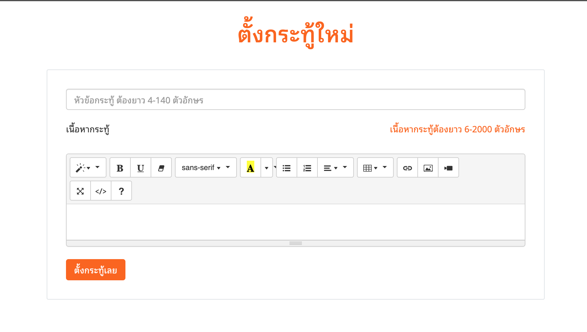
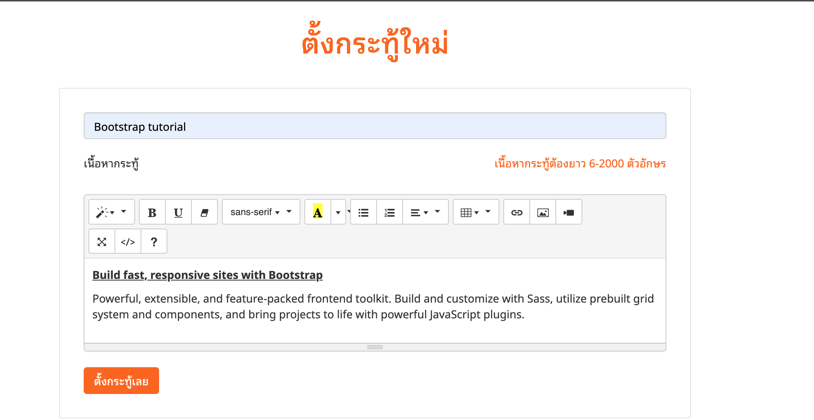
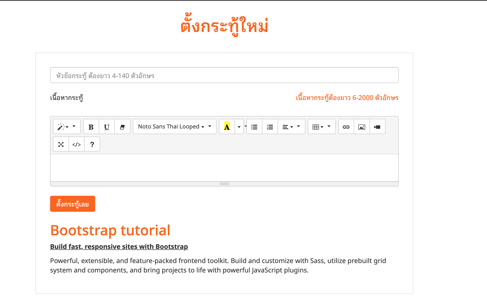
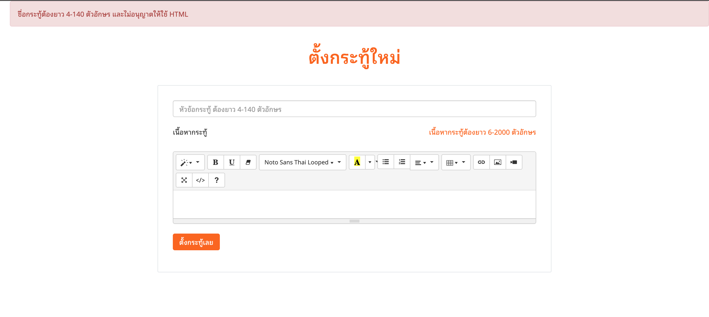
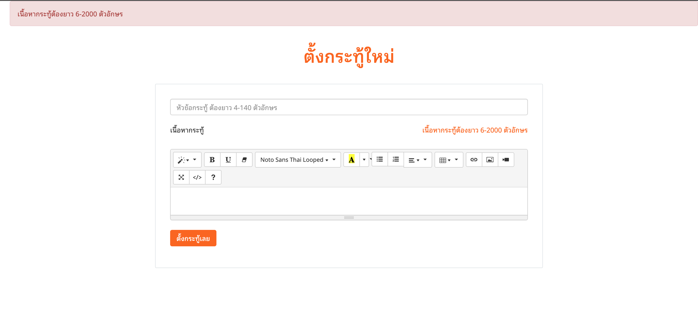
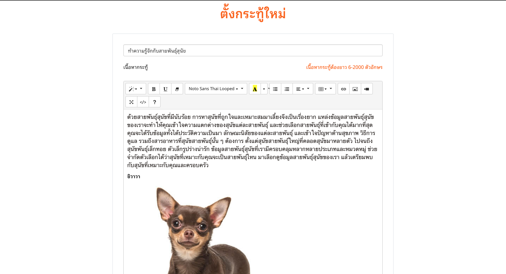

# กระทู้ของฉัน

    
    
    
    
    
     

# Tools
- PHP
- summernote

### Feature

- [ ] มีฐานข้อมูล
- [x] สามารถใส่ชื่อกระทู้ได้
- [x] สามารถใส่เนื้อหากระทู้ได้
- [x] มี Validation ว่าชื่อกระทู้ต้องยาว 4–140 ตัวอักษร
- [x] มี Validation ว่าชื่อกระทู้จะไม่อนุญาตใส่ HTML
- [x] มี Validation ว่าเนื้อหากระทู้ต้องยาว 6–2000 ตัวอักษร
